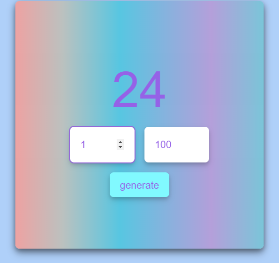

# Рандомайзер

**Рандомайзер** - это простое веб-приложение, позволяющее генерировать случайные числа в заданном диапазоне. 
Это приложение создано с использованием HTML, CSS и JavaScript, и может быть полезно для проведения жеребьевок, 
игр и других ситуаций, где необходимо случайное число.

## Особенности

- Генерация случайных чисел в заданном пользователем диапазоне.
- Визуальное отображение случайного числа.
- Простой и понятный интерфейс для использования.

## Использование

1. Откройте веб-приложение в вашем браузере.
2. Введите минимальное и максимальное значения в поля ввода.
3. Нажмите кнопку "Generate", чтобы получить случайное число.
4. После генерации будет показано случайное число.

## Пример

